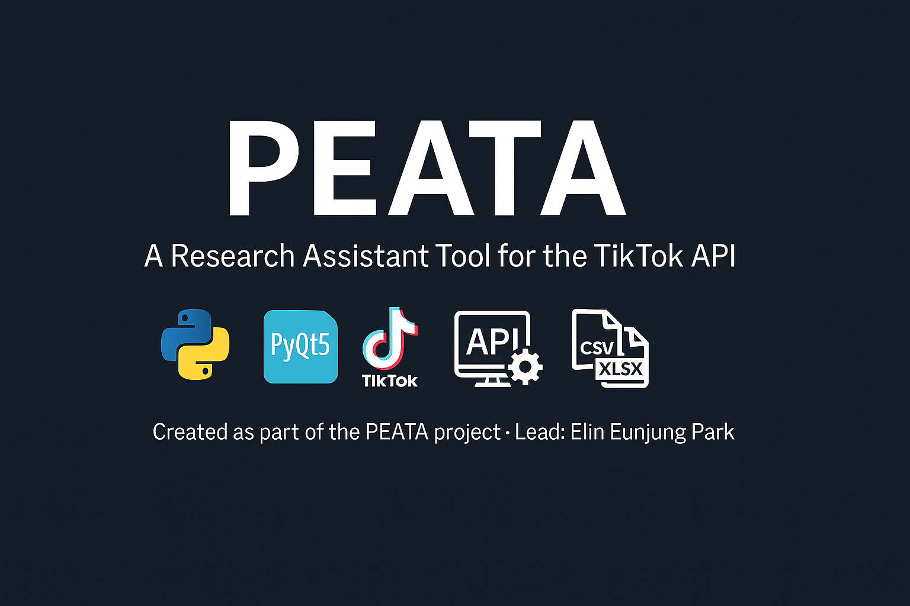
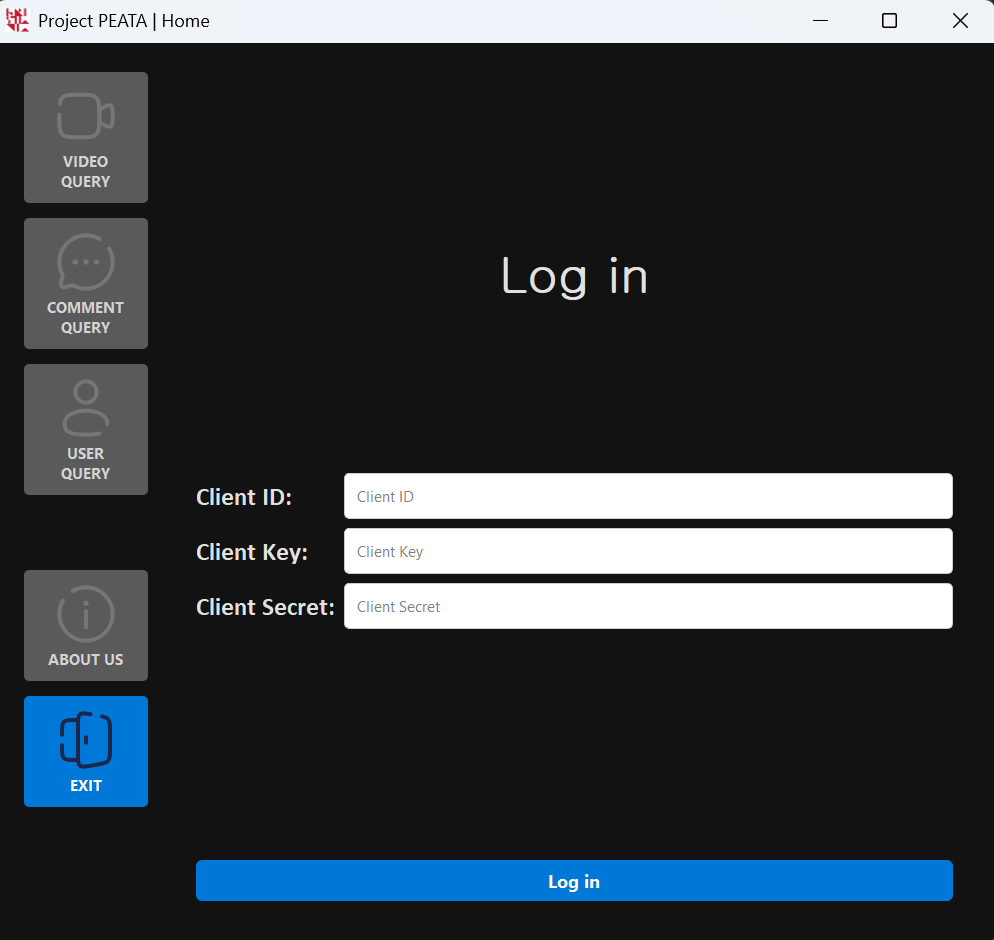
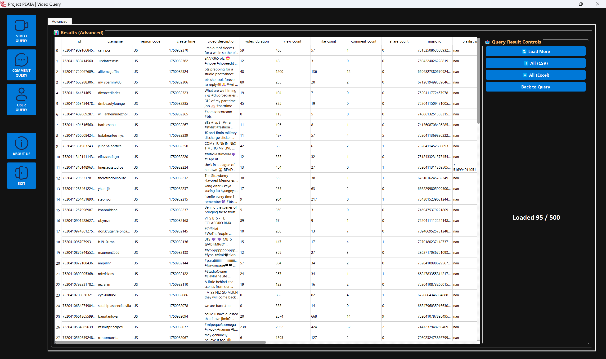
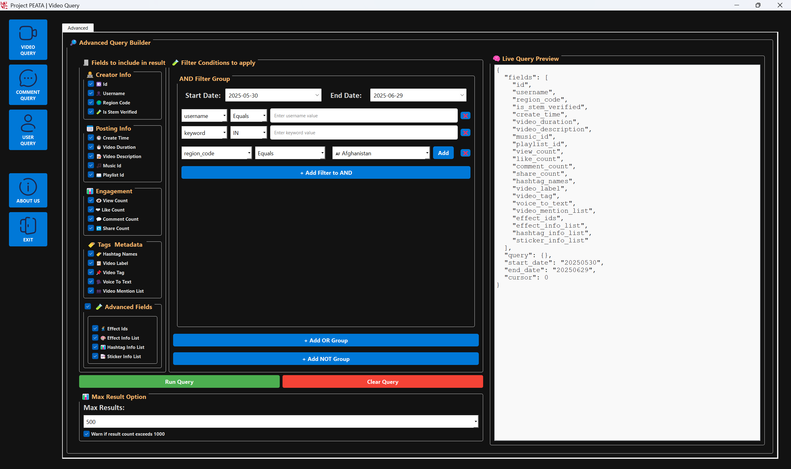
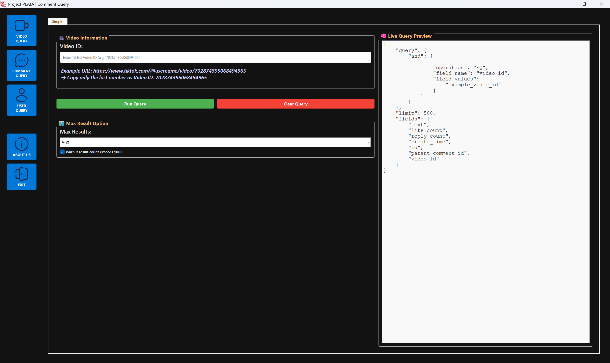
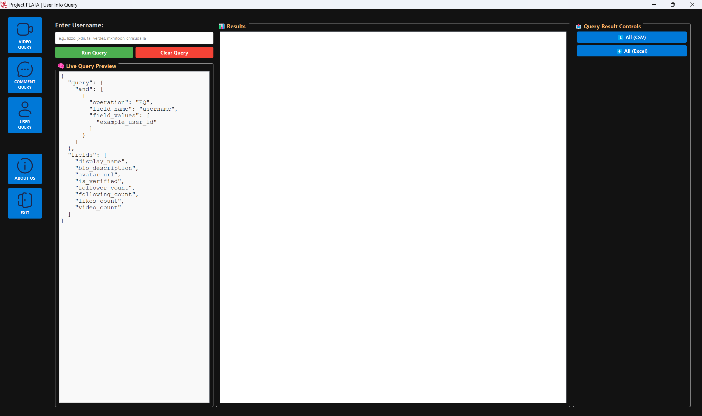

<p align="center">
  
</p>

# PEATA: Packages for Easier Access To APIs

**PEATA** is a Python-based research assistant tool that simplifies access to TikTok’s official Research API. Designed for social science researchers, it provides an intuitive GUI to search, preview and download public TikTok video, comment and user data with minimal technical setup.

More minimalist version built with Tkinter (GUI v1) is available here: https://github.com/amalie246/PEATA

> This version (GUI v2) was independently developed using **PyQt** for a modern and responsive desktop interface. While it shares initial backend logic with GUI v1, the codebase has since been extensively restructured and redesigned to support a more advanced and researcher-friendly experience.

---

## 🧩 What Makes PEATA Different?

Unlike traditional API tools, PEATA bridges the gap between researchers and complex APIs by offering:

- Real-time query previews
- Modular filter-building tools
- Export-ready data structures (Result table)
- Error-resilient and user-friendly UX

---

## 🔍 Key Features

- **Flexible Search Mode Architecture**: 
  Built to support both *Simple* and *Advanced* modes across query types.

    ✅ **Video Query**: Advanced mode implemented

    ✅ **Comment Query**: Simple mode implemented

    ✅ **User Info Query**: Simple mode only

   > Internal architecture is fully prepared for future dual-mode expansion.

- **Real-Time Query Preview**: 
  Instantly displays the generated query JSON for easier debugging and transparency.

- **Result Table with “Load More” Pagination**: 
  Review data in batches of up to 100 rows before downloading the full dataset - ideal for validating data quality

- **Prefetch Before Export**: 
  Supports quick data inspection through paginated results before downloading all.

- **Dynamic Filter Builder** *(Video Query)*: 
  Combine logic operators (AND/OR/NOT), field operators (Equals, IN, Greater than...), user defined values (username, keyword...), and region filters for precise control.

- **Customizable Field Selection**: 
  Select from 23+ TikTok fields using grouped checkboxes, tailored to your research needs.

- **Max Results Control**: 
  Select data volume limits to fetch (100 / 500 / 1000 / ALL) for efficient API requests.

- **Progress Tracking**: 
  Visual progress bar during data export operations.

- **Modular and Reusable UI**: 
  Built with consistent, clean PyQt components across query types.

- **Data Export to `.csv` / `.xlsx`**: 
  Download query results in well-structured format with predefined column ordering.

- **Robust Error Handling**: 
  User-friendly error messages with clear recovery paths and API error explanations

- **Standalone Executable**: 
  Available for Windows 10/11 (64-bit only) as `.exe` — see [Release Page](https://github.com/ElinEunjung/peata-v2/releases)

---

## 🚀 Getting Started 

## 👨‍🔬 For Researchers (No Python Needed)

To use the PEATA app:

1. Download `PEATA-v2.0.0-Windows-64bit.zip` from the [Releases](https://github.com/ElinEunjung/peata-v2/releases) page.
2. Double-click to open. No Python or setup needed.
3. Make sure you have valid TikTok Research API credentials.
4. Follow the in-app instructions.

> ℹ️ If Windows shows a security warning, click "More info" → "Run anyway". The app is unsigned but safe.

> ⚠️ **Important**: Do not move `PEATA.exe` out of the original folder. The app depends on internal files and will not work if moved elsewhere.

### 🖥 Tips for Easy Access (Windows)

To launch the app more easily in the future:

- **Pin to Taskbar**: While PEATA is running, right-click the icon in the taskbar → choose **"Pin to taskbar"**
- **Pin to Start Menu**: Right-click `PEATA.exe` → **Pin to Start**

This way, you don’t need to open the folder every time to start the app.
---

## 🛠️ For Developers

If you want to run or modify the source code:

### 📦 Understanding the Requirements Files

We maintain two separate requirements files:

| File | Purpose |
|------|---------|
| `requirements.txt` | Runtime dependencies — minimal set needed to run or package the app (e.g., into `.exe`). |
| `requirements-dev.txt` | Development environment — includes `requirements.txt` + formatting, testing, and linting tools. |


### Requirements

- Python 3.9+
- python packages listed in `requirements.txt` or `requirements-dev.txt`


### Developer Setup

To set up your local development environment:

```bash
git clone https://github.com/ElinEunjung/peata-v2.git
cd peata-v2
pip install -r requirements-dev.txt
```
This installs: 
- ✅ Runtime dependencies (PyQt5, pandas, requests, etc.)
- ✅ Dev tools: flake8, black, isort, pytest, and pre-commit
    
### Set Up Pre-Commit Hooks

To ensure clean code before every commit, run:

```bash
pre-commit install
```

This installs Git hooks that automatically check and fix your code formatting every time you commit.

### Start the app

To run the app:

```bash
python -m app.main
```

---

## 🧑‍💻 How to Use the App 
1. **Launch** the app.
2. **Sign in** with valid TikTok Research API credentials. 
3. **Select a query type** from the left menu (Video, Comment, or User) 

▶️ For a complete guide including how to run queries, set filters, and export results:
👉 see [PEATA app usage](docs/usage.md)

▶️ For visual reference, see [Interface Overview (Screenshots)](#-interface-overview-screenshots) section below.

---

## 🎇 Interface Overview (Screenshots)

| Login Screen | Home Screen | Exported Table |
|--------------|-------------|----------------|
|  |  |  |


**Query Preview Screens**

<table>
<tr>
<td></td>
<td></td>
<td></td>
</tr>
<tr>
<td><p align="center">Video Query</p></td>
<td><p align="center">Comment Query</p></td>
<td><p align="center">User Info Query</p></td>
</tr>
</table>

---

## 🎬 Live Demo

Watch PEATA in action:  
👉 [View Demo on YouTube](https://www.youtube.com/watch?v=niTPJAbzYD0&ab_channel=ElinP)

---

### 📝 Note: Make sure that your TikTok Research API credentials are valid to use this program.

---

## 🗃 Project Structure (v2.0.0)

```bash
peata-v2/
│
├── README.md
├── requirements.txt          # App and packaging dependencies
│
├── app/
│   ├── main.py               # App entry point
│   ├── assets/               # Icons, fonts, images for UI
│   ├── controller/           # Query builder, error handlers
│   ├── model/                # API handling, file processing, config
│   └── view/                 # PyQt5 GUI components
│
├── data/
│   ├── csv/                  # Exported CSV results
│   └── excel/                # Exported Excel results
│
└── docs/                     # Additional guides, screenshots, and debug info
   
```
---

## 📖 Documentation
* [PEATA App Usage Guide](docs/usage.md): step-by-step guide and filtering tips <br>
* [TikTok Video Fields Reference Guide](docs/fields-video.md) <br>
* [Query Design Tips](docs/query-design-tips.md)  <br>
* [Query Test Log](docs/query-test-log.md)  <br>
* [TikTok Video Filter Guide](docs/video-filter-guide.md) <br>
* [TikTok API Codebook Summary](docs/codebook-summary.md) <br>
* [Server Behavior And Debugging](docs/server-behavior-and-debugging.md) <br>
* [Preferred Field Order Summary](docs/preferred-field-orders.md) <br>
* [Release Notes for v2.0.0](docs/release-notes/release-v2.0.0.md) <br>

---

## 📄 License
This project is licensed under the MIT License – see the [LICENSE](./LICENSE) file for details.

---

## 👤 Project Credits (GUI v2 Repository Only)

This repository documents and contains the GUI v2 version of PEATA, implemented in PyQt5.
It is based on the initial Tkinter-based GUI v1 (available [here](https://github.com/amalie246/PEATA)). 
All roles listed below refer to this version (GUI v2) only.


| Name      | Version | Role                                                                                     |
|-----------|---------|------------------------------------------------------------------------------------------|
| Elin      | GUI v2  | Full GUI development, API integration, data handling, error handling, documentation, release packaging and distribution setup |
| Ibrahim   | GUI v2  | Co-designed GUI v2, implemented login flow and navigation menu in PyQt |
| Amalie    | GUI v1  | (Not contributor to this repo — see original v1 repository) |
| Oda       | GUI v1  | (Not contributor to this repo — see original v1 repository) |


> **Original Author**: PEATA Team (GUI v1) <br>
> **Refactored & Extended by**: Elin, Ibrahim (GUI v2, 2025) <br>
> This project was funded by Kristiania University of Applied Sciences, Spring 2025. <br>
> For bug reports, questions, or feature requests, please open an [issue](https://github.com/ElinEunjung/peata-v2/issues) or contact Elin directly. <br>

---

## 🧼 Query Design Tips

Learn how to design effective TikTok queries using filters, boolean logic, and pagination.

See full guidelines and tested examples in [Query Design Tips](docs/query-design-tips.md), [Query Test Logs](docs/query-test-log.md)

--- 

## 📌 Release Timeline

| Version | Date       | Summary                                |
|---------|------------|----------------------------------------|
| v2.0.0  | 2025-07-11 | First public release with full GUI |
| v1.4.1  | 2025-04-26 | Code improvement with filter logic |
| v1.4.0  | 2025-04-23 | Simplified filter builder & Improved UX  |
| v1.2.0  | 2025-04-20 | Stable structure & API spec Alignment |
| v1.0.0-beta | 2025-04-19 | Core GUI flow complete |


---

## 💻 Environment

- Python: 3.13.5
- PyQt5: 5.15.11
- PyInstaller: 6.14.2

