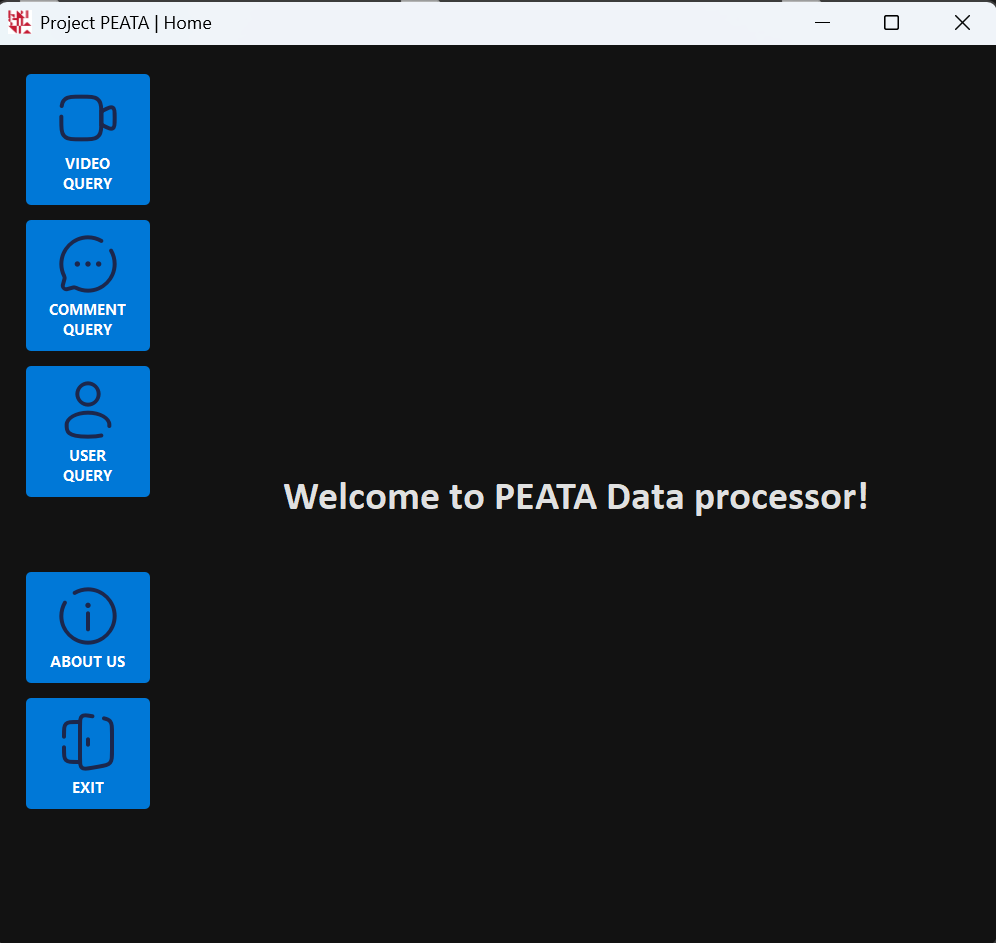

# PEATA: Packages for Easier Access To APIs

**PEATA** is a Python-based research assistant tool that simplifies access to TikTok’s official Research API. Designed for social science researchers, it provides an intuitive GUI to search, preview and download public TikTok video, comment and user data with minimal technical setup.

More minimalist version built with Tkinter (GUI v1) is available here: https://github.com/amalie246/PEATA

> This version (GUI v2) was independently developed using **PyQt** for a modern and responsive desktop interface. While it shares initial backend logic with GUI v1, the codebase has since been extensively restructured and redesigned to support a more advanced and researcher-friendly experience.

---

## 🧩 What Makes PEATA Different?

Unlike traditional API tools, PEATA bridges the gap between researchers and complex APIs by offering:

- Real-time query previews
- Modular filter-building tools
- Export-ready data structures (Result table)
- Error-resilient and user-friendly UX

---

## 🔍 Key Features

- **Flexible Search Mode Architecture**: 
  Built to support both *Simple* and *Advanced* modes across query types.

    ✅ **Video Query**: Advanced mode implemented

    ✅ **Comment Query**: Simple mode implemented

    ✅ **User Info Query**: Simple mode only

   > Internal architecture is fully prepared for future dual-mode expansion.

- **Real-Time Query Preview**: 
  Instantly displays the generated query JSON for easier debugging and transparency.

- **Result Table with “Load More” Pagination**: 
  Review data in batches of up to 100 rows before downloading the full dataset - ideal for validating data quality

- **Prefetch Before Export**: 
  Supports quick data inspection through paginated results before downloading all.

- **Dynamic Filter Builder** *(Video Query)*: 
  Combine logic operators (AND/OR/NOT), field operators (EQ, IN, GT...), user defined values (username, keyword...), and region filters for precise control.

- **Customizable Field Selection**: 
  Select from 23+ TikTok fields using grouped checkboxes, tailored to your research needs.

- **Max Results Control**: 
  Select data volume limits to fetch (100 / 500 / 1000 / ALL) for efficient API requests.

- **Progress Tracking**: 
  Visual progress bar during data export operations.

- **Modular and Reusable UI**: 
  Built with consistent, clean PyQt components across query types.

- **Data Export to `.csv` / `.xlsx`**: 
  Download query results in well-structured format with predefined column ordering.

- **Robust Error Handling**: 
  User-friendly error messages with clear recovery paths and API error explanations

- **Standalone Executable (Coming Soon)**: 
  A `.exe` version for Windows users is in development—no Python required.

---

## 🚀 Getting Started (For developer)

### 📦 Requirements

- Python 3.9+
- python packages listed in `requirements.txt`

### 🔧 Installation

> Coming soon: Executable version for Windows.

To run from source (developer setup):

```bash
git clone https://github.com/ElinEunjung/PEATA.git
cd PEATA
pip install -r requirements.txt
python -m app.main
```

---

## 🧑‍💻 How to Use the App
1. **Launch** the app.
2. **Sign in** with valid TikTok Research API credentials. 
3. **Select a query type** from the left menu (Video, Comment, or User) 
4. **Set filters and fields** as needed:
   - In *Video Query*, all available fields are checked by defalut. 
   - ([Query Design Best Practices](#-Best-query practice-guide) coming soon)
5. **Choose result size** using **Max Result** dropdown (default: 500).
   - Selecting more than 1000 will trigger an API quota warning.
6. **Click "Run Query"** to fetch data.
   - If the query is valid, a result table will appear. 
   - If required filters are missing (e.g., date range + at least one additional filter), you’ll see an error message.
7. **Review results** in the table view:
   - Click **"Load More"** to fetch additional results (up to 100 rows at a time.)
   - If the button is missing, it means all available data has been loaded.
   - If the results aren't satisfactory, click **“Back to Query”** to adjust your filters.
8. **Export results** to `.csv` or `.xlsx`:
   - Large datasets take time. 
   - A progress bar will appear (may seem frozen during heavy downloads).  
   - Messages will confirm both successful and failed exports. 
   > Don't worry if the app seems unresponsive during large exports — it's working! 😊
9. **Find exported files** in the `/data/` folder (`csv/` or `excel/` subfolder).

▶️ For visual reference, see [Interface Overview (Screenshots)](#-interface-overview-screenshots) section below.

---

## 🎇 Interface Overview (Screenshots)

| Login Screen | Home Screen | Exported Table |
|--------------|-------------|----------------|
|  |  |  |


**Query Preview Screens**

<table>
<tr>
<td></td>
<td></td>
<td></td>
</tr>
<tr>
<td>Video Query</td>
<td>Comment Query</td>
<td>User Info Query</td>
</tr>
</table>

---

## 🎬 Live Demo

Watch PEATA in action *(comming soon)*:  
👉 [View Demo on YouTube](https://youtu.be/your_video_link_here)

---

### 📝 Note: Make sure that your TikTok Research API credentials are valid to use this program.

---

## 🗃 Project Structure (v2.0.0)

```bash
PEATA/
│
├── README.md
│
├── app/
│   ├── main.py               # App entry point
│   ├── assets/               # Icons, fonts, images for UI
│   ├── bin/                  # [Reserved for executables/scripts]
│   ├── controller/           # Query builder, error handlers
│   ├── data/                 # Query result data (csv/excel)
│   ├── model/                # API handling, file processing, config
│   └── view/                 # PyQt5 GUI components
│
├── data/
│   ├── csv/                  # Exported CSV results
│   └── excel/                # Exported Excel results
│
└── docs/
    └── screenshots/
        ├── home.png
        ├── login.png
        ├── preview-video.png
        ├── preview-comment.png
        ├── preview-user.png
        └── table.png
    ├── preferred_field_orders.md
    ├── RELEASE_NOTE.md
    ├── server_behavior_and_debugging.md
    └── requirements.txt

```
---

## 📖 Documentation
❌ `docs/usage.md`: step-by-step guide *(will be available soon)*
❌ `docs/fields_video.md`: full field reference *(will be available soon)*
❌ `docs/changelog.md`: version history *(will be available soon)*

---

## 📄 License
MIT License — see `LICENSE` file *(will be available soon)*

---

## 👤 Author & Contributors

This project was developed in two parallel versions:  
- **GUI v1**: A simplified version using Tkinter  
- **GUI v2**: A redesigned and feature-rich version using PyQt (this repository)


| Name      | Version | Role                                                                                     |
|-----------|---------|------------------------------------------------------------------------------------------|
| Elin      | GUI v2  | Full PyQt GUI development, API integration, data handling, error handling, testing, documentation, setup |
| Ibrahim   | GUI v2  | Menu integration, login flow, UI coordination                                            |
| Amalie    | GUI v1  | Initial API integration and backend prototyping                                          |
| Oda       | GUI v1  | Login flow and early data handling                                                       |

> This project was funded by Kristiania University of Applied Sciences, Spring 2025.

> **Original Author**: PEATA Team
> **Refactored & Extended by**: Elin (2025)
> For bug reports, questions, or feature requests, please open an [issue](https://github.com/ElinEunjung/PEATA/issues) or contact Elin directly.

---

## 🧼 Query Design Best Practices  *(Experimental – Needs Further Testing)*

> The logic below is based on observed API behavior and may be updated after further testing.

When filtering videos by `keyword`, it is strongly recommended to combine it with either a `username` or a specific `region_code`. 
Otherwise, the TikTok Research API may return an `invalid_params` error, especially if the query is too broad.

| Condition | Result |
|:---|:---|
| `region_code` + `keyword` (rare keyword, small region) | ✅  |
| `region_code` + `keyword` (common keyword, large region) | ✅  |
| `username` + `keyword` | ✅  |
| `keyword` only | ❌ May fail with invalid_params |

**Best practice:** Always start with broad search with single filter. Normally, multiple `keyword` values ensures a successful query.

